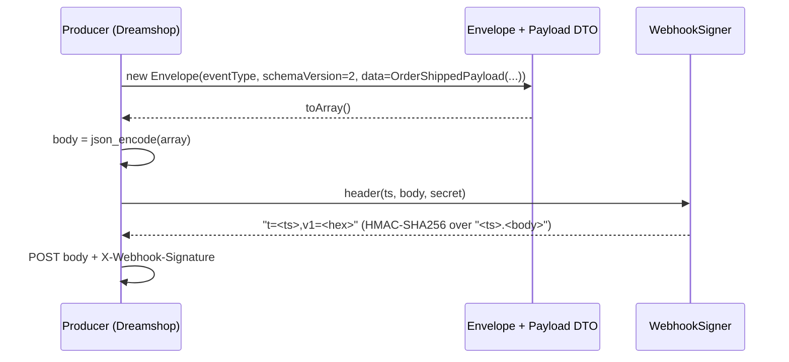
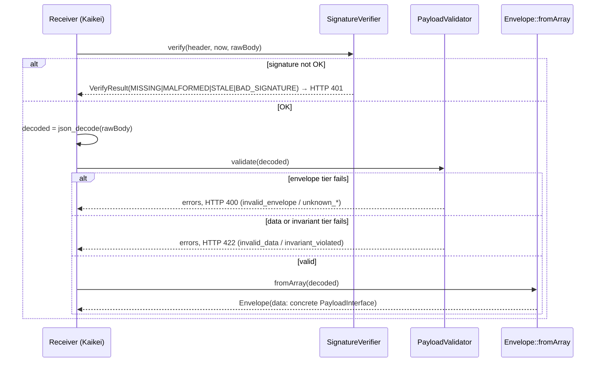
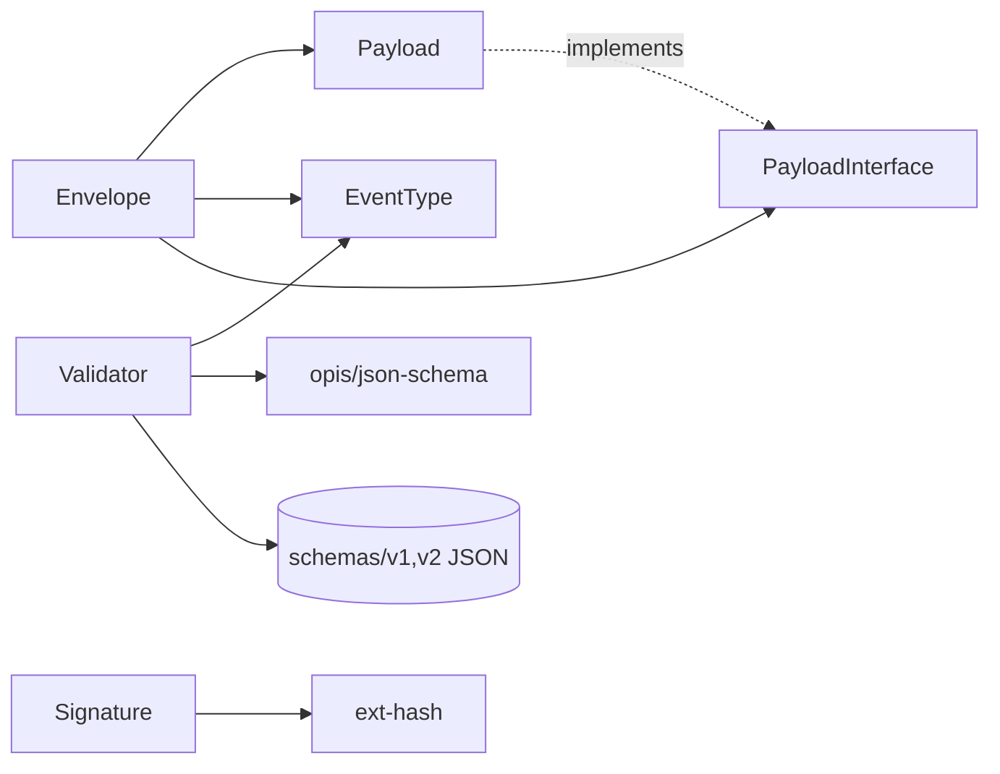

# Architecture: kaikei-envelope

> Graph-primary high-signal engineering reference (10-section modern structure).
> For token-optimized AI context, see `draft/.ai-context.md`.

---

## 1. Executive Summary + Graph Health Dashboard

`kaikei-envelope` is the **single canonical contract library** for kaikei webhook
deliveries, shared by **Dreamshop** (producer) and **Kaikei** (receiver → e-conomic).
It is a pure PHP 8.1+ value-object + validation + signing library — **no process, no
I/O, no persistence**. Consumers import it on both ends of an HTTP webhook so the wire
contract is defined exactly once instead of duplicated (and silently drifting) across
producer and receiver. [Existing:README.md §Purpose] [Graph:High]

It carries three concerns:
1. **Envelope + payload DTOs** — `Envelope` wraps a per-event-type `PayloadInterface`.
2. **Validation** — `PayloadValidator`, a 3-tier version-dispatching validator.
3. **Signing** — `WebhookSigner` / `SignatureVerifier`, the `t=<ts>,v1=<hex>` HMAC-SHA256 scheme.

The JSON Schemas under `schemas/v1` + `schemas/v2` are the **structural source of truth**;
the PHP DTOs are hand-mirrored against **v2** and a CI equivalence test guards agreement. [Existing:docs/decisions.md D3]

### Graph Health & Fidelity Dashboard

| Metric | Value | Source |
|--------|-------|--------|
| Build status | ok | `graph-init.sh` |
| Nodes / Edges | 1038 / 1910 | engine |
| PHP files | 27 (src) + tests | engine `.languages` |
| Classes / Enums / Interfaces | 23 / 2 / 1 | engine `.node_labels` |
| Methods | 160 | engine `.node_labels` |
| Top hotspot | `PayloadValidator::validate` (fanIn 33) | `hotspot-rank.sh` |
| Codebase tier | 1 (micro) | M≤5 core modules, F≤300, P=0 routes |
| Overall fidelity | High (whole codebase read at init) | — |

---

## 2. Critical Invariants & Safety Rules (with provenance)

| # | Invariant | Enforced where | Provenance |
|---|-----------|----------------|------------|
| I1 | An `EventType` backing string is **frozen** — renaming one (e.g. `order.shipped`) is a MAJOR bump; it invalidates every in-flight envelope + every `kaikei_delivery_log` audit row | `src/EventType.php` (doc contract) | [Existing:EventType.php:11] |
| I2 | `schema_version` selects the schema dir; only `{1, 2}` are supported, fail-closed with `unknown_schema_version` | `PayloadValidator::SUPPORTED_SCHEMA_VERSIONS`, `validateEnvelope()` | [Graph:High] [Existing:decisions.md D4] |
| I3 | Money is an **exact-2-decimal string** (`^-?\d+\.\d{2}$`); arithmetic uses `ext-bcmath` at scale 2 so producer + receiver compare identically | v2 schemas `$defs.decimal`; `checkInvariants()` | [Existing:decisions.md D4] |
| I4 | `order.fee` amount **> 0** (cross-field, schema can't express on a decimal string) | `PayloadValidator::feeErrors()` | [Graph:High] |
| I5 | `payout.paid`: `gross_amount == fee_amount + net_amount` (exact `bccomp`) | `PayloadValidator::payoutErrors()` | [Graph:High] |
| I6 | `order.refunded`: `sum(refund_payments.amount) == -sum(items.gross_amount)`; each refund amount > 0 | `PayloadValidator::refundErrors()` | [Graph:High] |
| I7 | shipped/prepaid item lines: `vat_amount <= gross_amount` on non-negative lines; `gift_card` lines have `vat_amount == '0.00'` | `PayloadValidator::itemLineErrors()` | [Graph:High] |
| I8 | B2B `order.shipped` requires `customer_id`, `name`, `vat_number`, full `address`, and `email`-unless-`ean_number` | `PayloadValidator::b2bCustomerErrors()` | [Graph:High] |
| I9 | Signature verify is **constant-time** (`hash_equals`); the `v1` in the header is the signature-scheme version, independent of `schema_version` | `SignatureVerifier`, docs/decisions.md D5 | [Existing:decisions.md D5] |
| I10 | `PayloadValidator::validate()` MUST run **before** `Envelope::fromArray()` — the DTO constructor throws on unknown/missing type and assumes validated input | `Envelope::fromArray()` doc | [Existing:Envelope.php:46] |

**Versioning rule:** adding an optional field is a MINOR bump; removing/changing a required
field is MAJOR. Adding an **enum member** (e.g. a new item `type` or `fee_type`) is additive
and, when done on v2 without a required-field change, does not force a `schema_version` bump —
mirroring how `order.fee` was added at 1.1.0. [Existing:README.md §Versioning] [Existing:EventType.php:17]

---

## 3. Primary Control & Data Flows (Graph + Synthesis)

### Producer flow (Dreamshop) — build → serialize → sign


### Receiver flow (Kaikei) — verify → validate → deserialize


### Validation pipeline (3 tiers) [Existing:decisions.md D4]
```mermaid
flowchart TD
    A[validate array] --> B[Tier 1: validateEnvelope<br/>hand-checked PHP]
    B -- missing/unknown/bad --> B1[HTTP 400<br/>invalid_envelope / unknown_*]
    B -- ok --> C[Tier 2: validateData<br/>opis vs schemas/v{n}/{event}]
    C -- schema fail --> C1[HTTP 422 invalid_data<br/>dotted path data.items[i].field]
    C -- ok --> D[Tier 3: checkInvariants<br/>bcmath cross-field, per EventType]
    D -- fail --> D1[HTTP 422 invariant_violated]
    D -- ok --> E[ValidationResult::ok]
```

---

## 4. Module & Dependency Map (Primarily Graph-Derived)

Namespace root: `Dreamabout\KaikeiEnvelope\` → `src/` (PSR-4).

| Module | Files | Role | Key symbols |
|--------|-------|------|-------------|
| (root) | `Envelope`, `EventType`, `PayloadInterface`, `Version` | Envelope value object, event-type enum, payload marker, package/schema version constants | `Envelope::fromArray/toArray`, `EventType::tryFromString` |
| `Payload/` | 6 DTOs | Per-event-type readonly value objects (`fromArray`/`toArray`) | `OrderShippedPayload`, `OrderFeePayload`, `OrderRefundedPayload`, `OrderCapturedPayload`, `PaymentPrepaidPayload`, `PayoutPaidPayload` |
| `Validator/` | `PayloadValidator`, `ValidationResult`, `FieldError` | 3-tier validation + result/error DTOs | `PayloadValidator::validate` (**hotspot fanIn 33**) |
| `Signature/` | `WebhookSigner`, `SignatureVerifier`, `VerifyResult` | HMAC-SHA256 signing + constant-time verification + result enum | `verify` (fanIn 14, cognitive 8), `header`, `sign` |

External runtime deps: `opis/json-schema ^2.3` (Tier-2 validation), `ext-json`, `ext-hash`
(HMAC), `ext-bcmath` (Tier-3 arithmetic). No other runtime dependencies. [Graph:High] [Existing:composer.json]

<!-- GRAPH:module-deps:START -->

<!-- GRAPH:module-deps:END -->

> The graph reports per-package `fan_in: 0` because coupling here is by class reference
> within one PSR-4 namespace rather than cross-package edges; the diagram above is
> synthesized from `use` statements verified by direct source read. [Human:Synthesis]

---

## 5. Concurrency, Ownership & Isolation Model

**Single-threaded, stateless, immutable.** Every DTO is a `final` class with `readonly`
promoted properties; `PayloadInterface` implementations are value objects. `Version` and
the enums are effectively constants. There is no shared mutable state, no thread pool, no
async, no locks. `PayloadValidator` is instantiable with an injectable `opis\Validator`
and `schemaDir` (constructor DI) and holds only readonly config. Safe to construct per
request or reuse across requests. [Graph:High]

---

## 6. Error Handling & Failure Mode Catalog

| Surface | Failure | Behaviour | Code / Status |
|---------|---------|-----------|---------------|
| `PayloadValidator` Tier 1 | missing/unknown envelope key, bad `event_id`/`event_type`/`schema_version`/`occurred_at`/`data` | collected `FieldError`s | HTTP 400 — `invalid_envelope`, `unknown_envelope_field`, `unknown_event_type`, `unknown_schema_version` |
| `PayloadValidator` Tier 2 | payload violates JSON schema | opis error tree → leaf `FieldError`s with `data.`-rooted dotted paths | HTTP 422 — `invalid_data` |
| `PayloadValidator` Tier 3 | cross-field arithmetic / B2B / positivity invariants | collected `FieldError`s | HTTP 422 — `invariant_violated` (or `invalid_data` for B2B) |
| `PayloadValidator::loadSchema` | schema file missing (misconfigured `schemaDir`) | `\RuntimeException` (tested) | — |
| `Envelope::fromArray` | missing/non-string `event_type`, unknown type, non-array `data` | `\InvalidArgumentException` | — (assumes pre-validated input, I10) |
| `SignatureVerifier::verify` | absent/malformed header, stale timestamp, bad HMAC | `VerifyResult` enum (never throws) | caller maps to HTTP 401 |

Errors are **collected, not short-circuited** within a tier (except the required-key gate),
so a caller sees all failures in a tier at once. Codes + field paths are parity-stable with
Kaikei's live `PayloadValidator`; only human messages differ. [Existing:decisions.md D4]

---

## 7. State & Data Truth Sources + Reconciliation

- **Structural truth:** `schemas/v1/*.json` (faithful mirror of the deployed wire contract)
  and `schemas/v2/*.json` (cleaner forward contract, `additionalProperties: false`,
  exact-2-decimal money). [Existing:README.md]
- **DTO ↔ schema reconciliation:** DTOs are hand-mirrored against **v2**; drift is caught at
  CI by `tests/Schema/SchemaDtoEquivalenceTest`. [Existing:decisions.md D3]
- **Schema ↔ fixtures reconciliation:** `tests/Schema/SchemaLintTest` compiles every schema
  and asserts each `valid.json` passes and each `invalid_*.json` is rejected, for v1 and v2.
- **Version truth:** `Version::PACKAGE_VERSION` (1.1.0) is asserted against the latest
  CHANGELOG entry by CI; `Version::SCHEMA_VERSION` (2) is the contract DTOs emit and is
  independent of the package release version. [Existing:Version.php]

There is no database or runtime persistence; "state" is entirely the on-wire contract.

---

## 8. Extension Points & Safe Mutation Patterns

Adding or extending an event type is the primary mutation. The wiring that MUST stay in
lockstep (verified by source read):

**Add a new event type** (e.g. a hypothetical `order.x`):
1. `src/EventType.php` — add an enum case with its wire string.
2. `src/Payload/OrderXPayload.php` — new `final` DTO implementing `PayloadInterface` (`fromArray`/`toArray`).
3. `src/Envelope.php` — add the `match` arm in `fromArray()` (PHP `match` is exhaustive → omitting it is a compile-visible gap).
4. `schemas/v1/order_x.payload.schema.json` + `schemas/v2/order_x.payload.schema.json`.
5. `src/Validator/PayloadValidator.php` — add a `checkInvariants()` `match` arm (return `[]` if no cross-field rule).
6. `tests/fixtures/v{1,2}/order_x/valid.json` + `invalid_*.json`; docs under `docs/events/`.

**Extend an existing enum (additive — the shape this project's next track takes):**
- **New item `type`** → edit the `item.$defs.type` enum in `schemas/v{1,2}/order_shipped` +
  `order_refunded` + `payment_prepaid` (any event carrying `items[]`); add/adjust any Tier-3
  rule in `itemLineErrors()` if the new type has special VAT/amount semantics (as `gift_card` does);
  add fixtures. Current item enum: `["physical", "gift_card", "digital"]`. [Graph:High]
- **New `fee_type`** → edit the `fee_type` enum in `schemas/v{1,2}/order_fee`; `feeErrors()`
  already covers the positivity invariant generically. Current enum: `["processing", "chargeback"]`. [Graph:High]
- The DTOs keep `items[]`/nested objects as `array<string,mixed>`, so enum additions need
  **no DTO change** — only schema + fixtures + (optionally) a Tier-3 rule. This is why enum
  additions are low-blast-radius MINOR changes. [Human:Synthesis]

---

## 9. Graph Coverage Gaps & Known Limitations (MANDATORY)

Full coverage — justification: this is a tier-1 micro library (27 PHP source files, ~1.4 KLOC
in `src/`). Every source file was read directly during init, so the architecture model is not
graph-inferred at the leaf level — the graph was used only for hotspot ranking and structural
confirmation. Known limitations:

- The engine reports per-package `fan_in/fan_out` as 0 because intra-namespace class references
  aren't modeled as package edges here; dependency edges in §4 are synthesized from verified
  `use` statements rather than graph edges. This does not affect fidelity of the module map.
- No routes/RPC surface exists (P=0) — this is a library, not a service; §API-style sections are N/A.
- Behaviour of the **live** Dreamshop producer and Kaikei receiver is out of repo scope; this
  doc describes only the shared contract library. Parity claims trace to `docs/decisions.md`.

---

## 10. Relationship to Other Authoritative Documentation (MANDATORY)

Context Quality: **Medium** — the repo ships strong purpose-written docs. This architecture.md
is the graph-primary spine; it **defers** to these and does not duplicate them:

- `README.md` — install, producer/receiver usage examples, supported event-type table, versioning policy. **Authoritative for consumer-facing usage.**
- `docs/decisions.md` — D1–D5 design decisions (opis choice, draft 2020-12, hand-mirrored DTOs, the 3-tier validator, signer/verifier mirroring). **Authoritative for "why".**
- `docs/events/*.md` — per-event field references. **Authoritative for field-level payload detail.**
- `docs/security.md` — signing scheme + rotation. **Authoritative for signature operations.**
- `schemas/v{1,2}/*.json` — **authoritative structural contract** (this doc summarizes, never restates, field-by-field schema).

This file adds: the cross-cutting graph spine, the synthesized flow/pipeline diagrams, the
invariant catalog with enforcement provenance, and the extension-point wiring checklist — none
of which live in a single existing doc. [Human:Synthesis]
